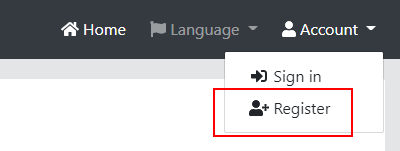
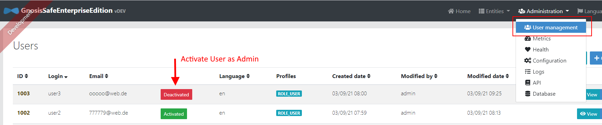
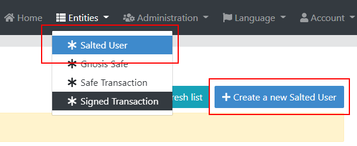
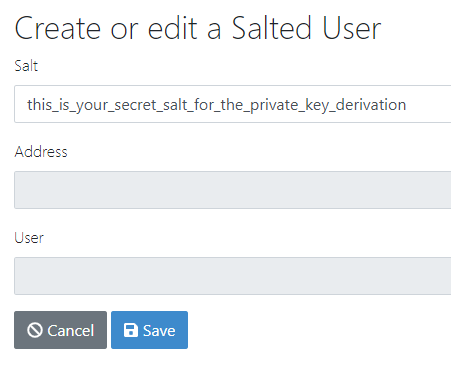
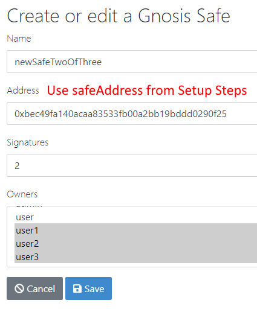
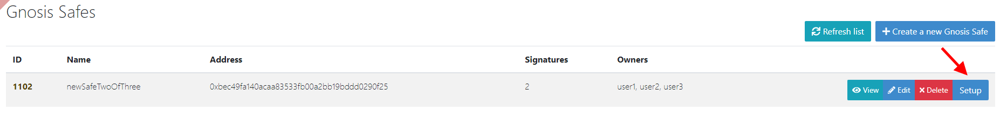
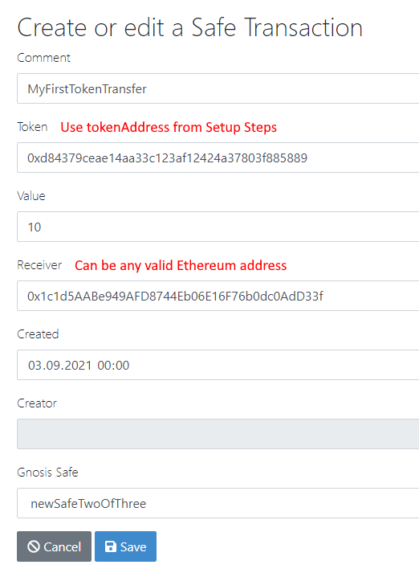
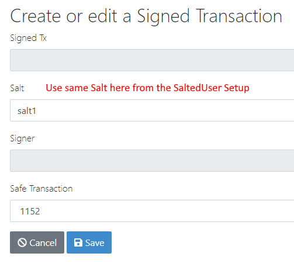
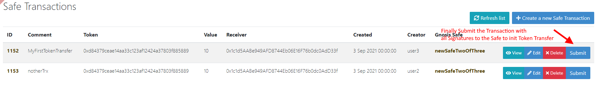

# gnosis-safe-enterprise-client-ui

The UI for the [Gnosis-Safe-Enterprise-Client](https://github.com/ice09/gnosis-safe-enterprise-client) was generated by [JHipster](https://www.jhipster.tech/).
It provides a CRUD-UI for Gnosis Safes with integrated RBAC.

## Prerequisites

- Node 14.16+
- Java 11+
- Maven 3+

## Setup Gnosis-Safe-Enterprise-Client REST Services

- [Gnosis-Safe-Enterprise-Client](https://github.com/ice09/gnosis-safe-enterprise-client) is running and a Safe and a Token with allowance for the Safe have been deployed (see HTTP requests below)
  - Note `safeAddress` and `tokenAddress`

```
### Deploy Safe

# @name safeDto
POST http://localhost:8888/api/deploySafe HTTP/1.1
content-type: application/json

@safeAddress = {{safeDto.response.body.address}}

### Deploy Sample Token with allowance for Safe

# @name tokenDto
POST http://localhost:8888/api/deploySampleToken?gnosisSafeAddress={{safeAddress}}&value=100 HTTP/1.1
content-type: application/json

@tokenAddress = {{tokenDto.response.body.address}}
```

## Setup

- `npm install`
- `mvnw`
- (new terminal) `npm start`

## Walk-Through of a 2-of-3 Multisig Transaction

### Register new Users

Users can register themselves with an Email address.  
If no mail server is available, the admin (admin/admin) can activate those users in _User Management_.



For the 2-of-3 test, we register 3 users (user1, user2, user3) and activate them with the Admin account.



### Derive address for new users from salt

All 3 users must create a `SaltedUser` with a salt which is used to derive the wallet address.





### Create new Safe

Any user can create a new Gnosis Safe and assign other users to it. Those users will see the Safe and the transactions associated with it.



### Setup the Safe for 2-of-3 Multisig



### Create new Transaction

Any of the 3 users can create a new Transaction, the other users of the associated Safe will be able to see it.



### Sign the new Transaction

2 of 3 users of the Safe must sign the new Transaction with their Salt used in the `SaltedUser` setup.



### Submit the Transaction


